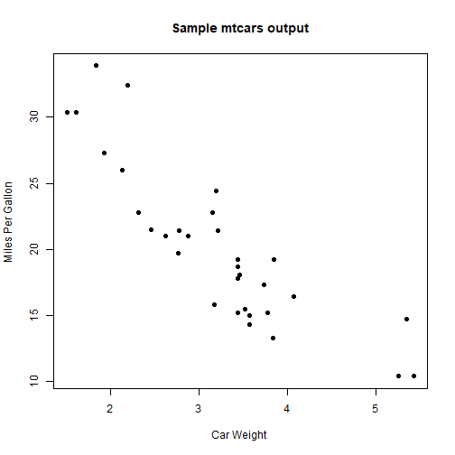

## Project Presentation

We will create a web application using Shiny. 

We will analys data from mtcars dataset.

The user will be able to view different type of charts based on selection.

Users will be able to view how car consumption is influenced by car weight.

User can chose to view liear models or consumption allocations.


--- .class #id 

## How was the web application built

We use Shiny to build the web application. 

The ui.R file has a "inputSelect" to allow user to select type of chart.

the server.R generates ggplot2 type of charts based on selection.


Click next when you are ready to navigate to the application.

--- .class #id 

Some code example from the web applications include the follwoing:


```r
  attach(mtcars) 
 plot(wt, mpg, main="Sample mtcars output", xlab="Car Weight ", ylab="Miles Per Gallon ", pch=19) 
```



--- .class #id 

## Navigate to web application

Click [here](https://ylli.shinyapps.io/DataProject/) to navigate to url. 

(or follow this link: https://ylli.shinyapps.io/DataProject/)
